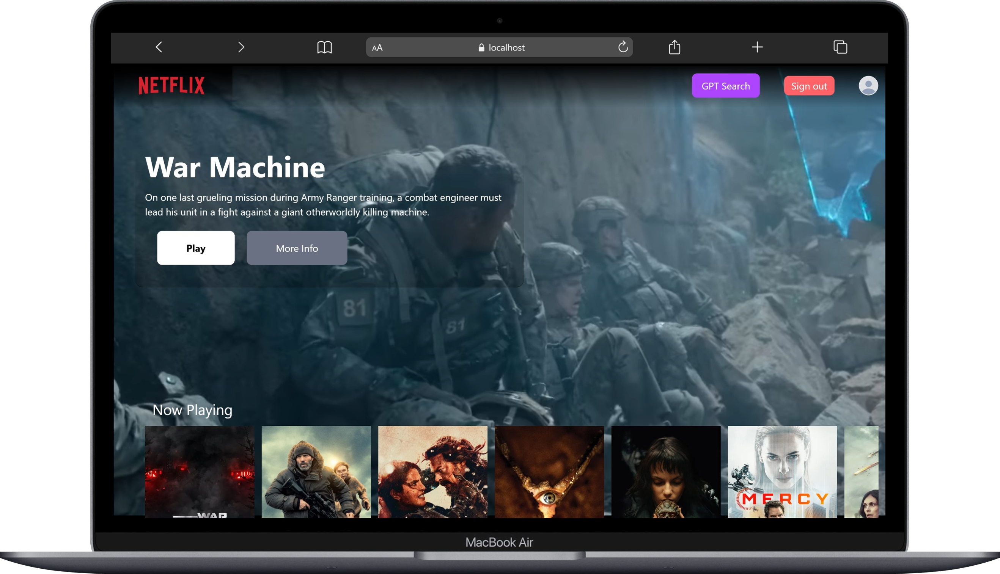
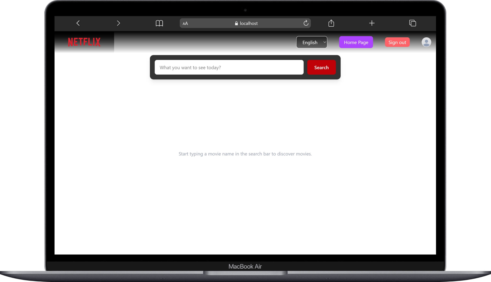

# Netflix-gpt (Movie App)

## Live Demo

https://ntflixgpt.netlify.app/

## Screenshot

## Features

- Design Sign In / Sign Up Form
- Setup Route
- Setup Tailwind CSS
- Toggle Sign In / Sign Up form
- form validation
- Implementation Authentication (SignIn/SignUp) on firebase
- setup redux store with userSlice and update useSlice
- Update Profile with displayName & profileUrl
- signout logic and redirect to login page
- protect Route if user not logged in redirect to Login - vice versa
- unsubscribe to the the onAuthStateChanged callback
- add hardcode value to contant file
- Register on TMDB API and get API key, Access token
- make API call and get playing movies data
- Get Movie Trailer
- display Trailer on Sign In/Sign Up
- Build Secondary Component
- Create Movie list
- Create Movie Cart
- TMDB CDN url for image (secondary conatiner)
- create GPT Page
- make multi language
- My API Limit exceed
- search movies by search box
- use debounce function to search
- dispay searched movies
- Use Memoization for performance
- make responsive for (Desktop, Tab, & Mobile) screen

## Tech Stack

- React
- Redux Toolkit
- Tailwind CSS
- Firebase Authentication
- TMDB API

## Installation

1. Clone the repository
   - git clone https://github.com/username/project-name.git

2. Go to project folder
   - cd project-name

3. Install dependencies
   - npm install

4. Run the project
   - npm run dev

## Author

Ajmat Ali

GitHub: https://github.com/Ajmat-Ali
